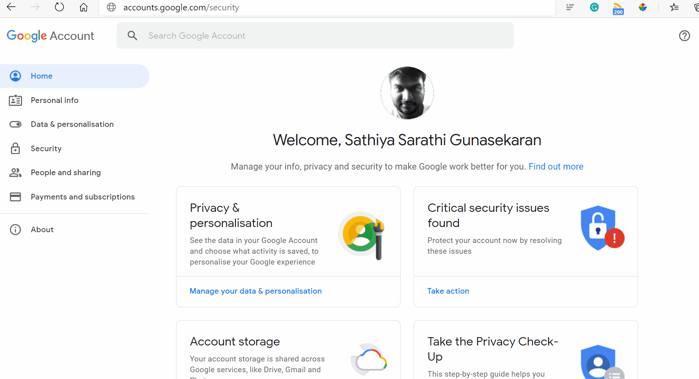

```text
      ___           ___                       ___           ___           ___           ___           ___     
     /__/\         /  /\          ___        /  /\         /__/\         /__/\         /  /\         /__/\    
    _\_ \:\       /  /::\        /  /\      /  /:/         \  \:\       |  |::\       /  /::\        \  \:\   
   /__/\ \:\     /  /:/\:\      /  /:/     /  /:/           \__\:\      |  |:|:\     /  /:/\:\        \  \:\  
  _\_ \:\ \:\   /  /:/~/::\    /  /:/     /  /:/  ___   ___ /  /::\   __|__|:|\:\   /  /:/  \:\   _____\__\:\ 
 /__/\ \:\ \:\ /__/:/ /:/\:\  /  /::\    /__/:/  /  /\ /__/\  /:/\:\ /__/::::| \:\ /__/:/ \__\:\ /__/::::::::\
 \  \:\ \:\/:/ \  \:\/:/__\/ /__/:/\:\   \  \:\ /  /:/ \  \:\/:/__\/ \  \:\~~\__\/ \  \:\ /  /:/ \  \:\~~\~~\/
  \  \:\ \::/   \  \::/      \__\/  \:\   \  \:\  /:/   \  \::/       \  \:\        \  \:\  /:/   \  \:\  ~~~ 
   \  \:\/:/     \  \:\           \  \:\   \  \:\/:/     \  \:\        \  \:\        \  \:\/:/     \  \:\     
    \  \::/       \  \:\           \__\/    \  \::/       \  \:\        \  \:\        \  \::/       \  \:\    
     \__\/         \__\/                     \__\/         \__\/         \__\/         \__\/         \__\/    
```

---

A command-line utility to link to cron that monitors the machine's disk and RAM usage based on threshold
and reports it to the mentioned emails.

!Important: The machine should have email access with SMTP configurations set. Installation of this package
will install `mutt` to be used as an email client.
 

```text
usage: watchmon [options]
  options:
                -t=, --threshold=    Threshold percentage of the Memory & Disk
                -e=, --emails=       Email or Multiple Emails separated by commas

```

## Setup:

### Setting up SSMTP

This step is a manual one, since your gmail username and password are sensitive. Only then the email will work.

```bash
sudo apt-get install ssmtp

sudo cat /etc/ssmtp/ssmtp.conf << EOF

AuthUser=yourusername@gmail.com
AuthPass=yourgmailpassword
FromLineOverride=YES
mailhub=smtp.gmail.com:587
UseSTARTTLS=YES

EOF
```

### GMail Permissions

Oh, And one more thing!

Visit [https://myaccount.google.com/security](https://myaccount.google.com/security) and toggle the less secure app access to ON.


