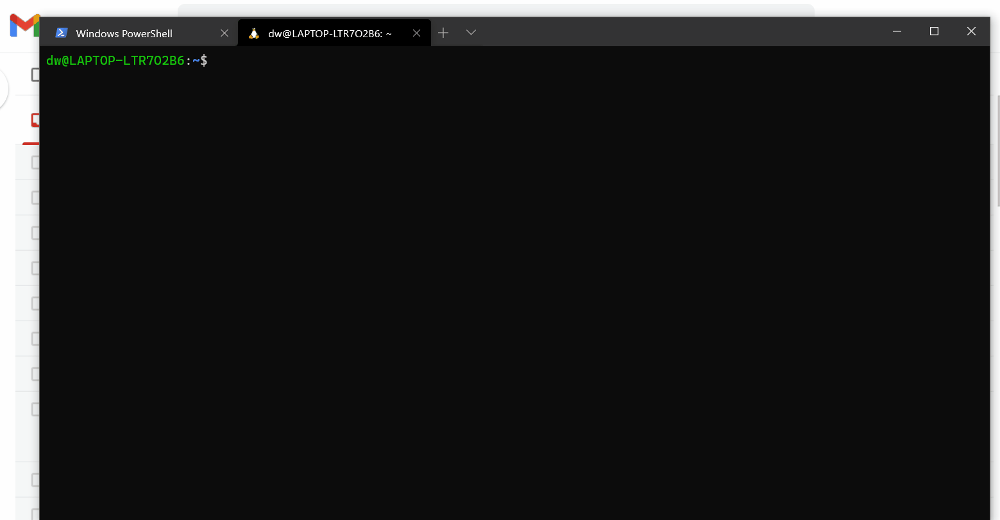

```text
      ___           ___                       ___           ___           ___           ___           ___     
     /__/\         /  /\          ___        /  /\         /__/\         /__/\         /  /\         /__/\    
    _\_ \:\       /  /::\        /  /\      /  /:/         \  \:\       |  |::\       /  /::\        \  \:\   
   /__/\ \:\     /  /:/\:\      /  /:/     /  /:/           \__\:\      |  |:|:\     /  /:/\:\        \  \:\  
  _\_ \:\ \:\   /  /:/~/::\    /  /:/     /  /:/  ___   ___ /  /::\   __|__|:|\:\   /  /:/  \:\   _____\__\:\ 
 /__/\ \:\ \:\ /__/:/ /:/\:\  /  /::\    /__/:/  /  /\ /__/\  /:/\:\ /__/::::| \:\ /__/:/ \__\:\ /__/::::::::\
 \  \:\ \:\/:/ \  \:\/:/__\/ /__/:/\:\   \  \:\ /  /:/ \  \:\/:/__\/ \  \:\~~\__\/ \  \:\ /  /:/ \  \:\~~\~~\/
  \  \:\ \::/   \  \::/      \__\/  \:\   \  \:\  /:/   \  \::/       \  \:\        \  \:\  /:/   \  \:\  ~~~ 
   \  \:\/:/     \  \:\           \  \:\   \  \:\/:/     \  \:\        \  \:\        \  \:\/:/     \  \:\     
    \  \::/       \  \:\           \__\/    \  \::/       \  \:\        \  \:\        \  \::/       \  \:\    
     \__\/         \__\/                     \__\/         \__\/         \__\/         \__\/         \__\/    
```

---

A command-line utility to link to cron that monitors the machine's disk and RAM usage based on threshold
and reports it to the mentioned emails.

!Important: The machine should have email access with SMTP configurations set. Installation of this package
will install `mutt` to be used as an email client.
 

```text
usage: watchmon [options]
  options:
                -t=, --threshold=    Threshold percentage of the Memory & Disk
                -e=, --emails=       Email or Multiple Emails separated by commas

```

**Example**

```bash
> bash watchmon.sh -t=90 -e=recipient_email@gmail.com
```

## Setup

* Cron & Mutt

Run the script in the root of the project as:

```bash
> git clone https://github.com/datawrangl3r/watchmon
> cd watchmon
> bash setup.sh
```

The script will start the cron process, install mutt and creates a directory in the home as: `/home/user/mutt/mutt.rc`. Edit this file based on your needs by replacing your email address and passwords locally.

```plaintext
set ssl_starttls=yes
set ssl_force_tls=yes

set imap_user = "change_this_user_name@gmail.com"
set imap_pass = "PASSWORD"

set from="change_this_user_name@gmail.com"
set realname="Your Name"

set folder = "imaps://imap.gmail.com/"
set spoolfile = "imaps://imap.gmail.com/INBOX"
set postponed="imaps://imap.gmail.com/[Gmail]/Drafts"

set header_cache = "~/.mutt/cache/headers"
set message_cachedir = "~/.mutt/cache/bodies"
set certificate_file = "~/.mutt/certificates"

set smtp_url = "smtps://change_this_user_name@gmail.com:PASSWORD@smtp.gmail.com:465/"

set move = no
set imap_keepalive = 900
```

*  **GMail Permissions**

Oh, And one more thing! If your SMTP server happens to be google: Google restricts the usage of its services from less secure apps. We need to enable access for the email account to be used in the SMTP settings.

Visit [https://myaccount.google.com/security](https://myaccount.google.com/security) and toggle the less secure app access to ON.


* **Setting up Crontab**

1) Open Crontab:

```bash
> crontab -e
```

2) Enter the Cron expression & Command

In the following example, the command is set to be run every minute. Hence, if the threshold that you have set, is crossed the inbox will be flooded with email alerts.

```plaintext
* * * * * /mnt/c/Users/sathy/Documents/datawrangler/watchmon/watchmon.sh -t=40 -e=sathyasarathi90@gmail.com
```

